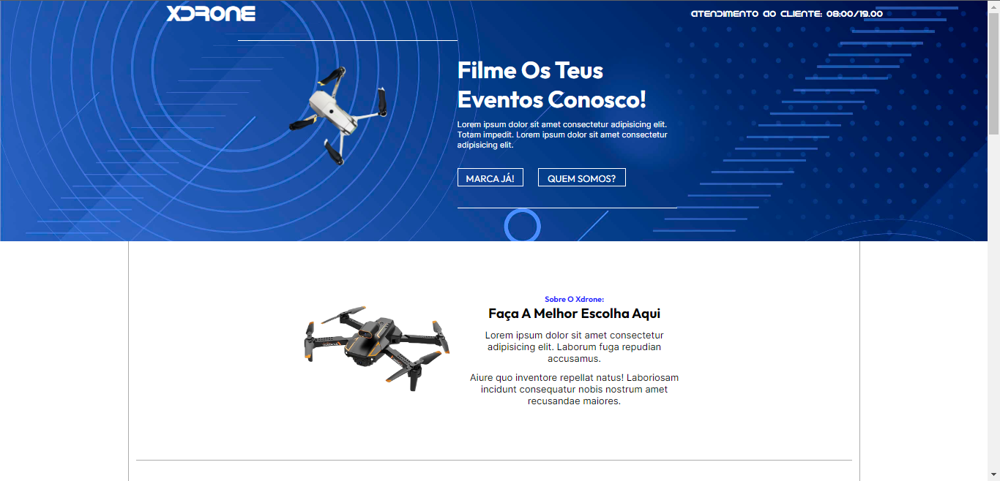
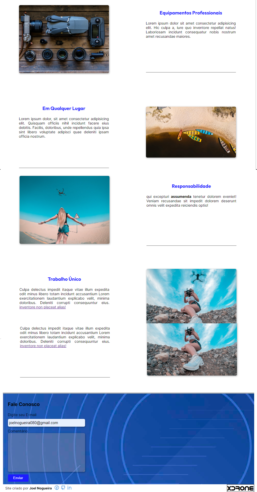

# xdrone
 Exemplo de Site Que Presta Serviço para Filmagens com Drone. Utilizado: CSS Grid, Totalmente Responsivo.

[Clica Aqui Para Ver O Site](https://joelnogueira.github.io/xdrone/)

`Design head `

 

`Design down`

 

